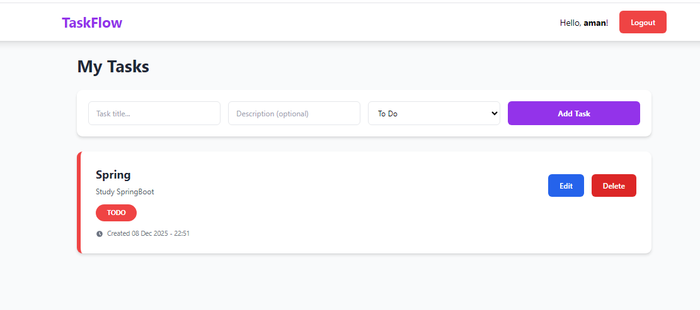
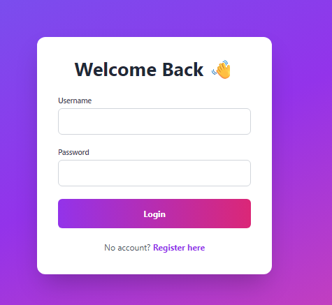
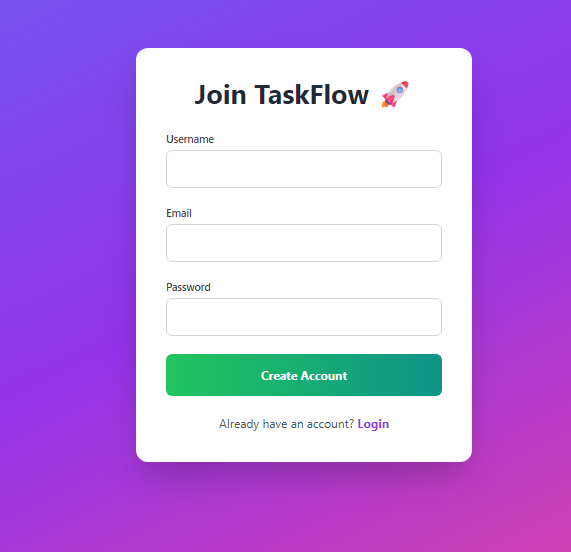

# Task-Manager - Your Personal Task Manager

A **beautiful, secure, and fully functional** Task Management Web App built with **Spring Boot 3**, **Spring Security**, **Thymeleaf**, **PostgreSQL**, and **Tailwind CSS**.

No JavaScript. Fully server-side rendered. Production-ready.



## Features

- Secure Register & Login (Spring Security + BCrypt password hashing)
- Create, Edit, Delete Tasks
- Task Status: `To Do` → `In Progress` → `Done` (with color coding)
- Beautiful, responsive UI using Tailwind CSS
- Task creation timestamp
- Persistent data with PostgreSQL
- Clean, modern, and professional design

## Screenshots

| Login Page                          | Register Page                        | Dashboard (Home)                          |
|-------------------------------------|--------------------------------------|-------------------------------------------|
|              |         |                      |

> Simple & clean login • Easy registration • Modern dashboard with color-coded tasks

## Tech Stack

- **Backend**: Spring Boot 3 + Spring MVC + Spring Data JPA
- **Security**: Spring Security + BCrypt
- **Database**: PostgreSQL (persistent)
- **Templating**: Thymeleaf
- **Styling**: Tailwind CSS (via CDN)
- **Build Tool**: Maven
- **Java**: 17+ (Java 25 recommended)

## Core Endpoints & Navigation

| Method | Endpoint | Description | Access |
|--------|----------|-------------|--------|
| `GET`  | `/`      | Login Page / Index | Public |
| `GET`  | `/register` | User Registration Page | Public |
| `POST` | `/register` | Create a new account | Public |
| `GET`  | `/home`  | User Dashboard (Task List) | Logged In |
| `POST` | `/add-task` | Create a new task | Logged In |
| `GET`  | `/edit-task/{id}` | Edit task form | Logged In |
| `POST` | `/edit-task/{id}` | Update task details | Logged In |
| `POST` | `/delete-task` | Remove a task | Logged In |

## Quick Setup (5 Minutes)

### 1. Prerequisites
- Java 17+
- PostgreSQL (running)
- Maven

### 2. Clone the Project
```bash
git clone https://github.com/subhashree0454/Task-Manager.git
cd Task-Management
```

### 3. Setup PostgreSQL Database
```sql
CREATE DATABASE taskflow_db;
CREATE USER taskflow_user WITH PASSWORD 'yourpassword123';
GRANT ALL PRIVILEGES ON DATABASE taskflow_db TO taskflow_user;
```

### 4. Configure Database (`application.properties`)
```properties
spring.datasource.url=jdbc:postgresql://localhost:5432/task
spring.datasource.username=postgres
spring.datasource.password=123
spring.datasource.driver-class-name=org.postgresql.Driver

spring.jpa.hibernate.ddl-auto=update
spring.jpa.show-sql=true
spring.jpa.database-platform=org.hibernate.dialect.PostgreSQLDialect
```

### 5. Production Configuration (Environment Variables)
For security, avoid hardcoding credentials. You can override properties using Environment Variables:

| Variable | Description |
|----------|-------------|
| `SPRING_DATASOURCE_URL` | DB Connection String |
| `SPRING_DATASOURCE_USERNAME` | DB Username |
| `SPRING_DATASOURCE_PASSWORD` | DB Password |

Example:
```bash
export SPRING_DATASOURCE_URL=jdbc:postgresql://your-host:5432/task_db
export SPRING_DATASOURCE_USERNAME=prod_user
export SPRING_DATASOURCE_PASSWORD=secure_password123
```

### 6. Run the App
```bash
./mvnw spring-boot:run
```

Open → [http://localhost:8080](http://localhost:8080)

### 7. Development Tips
- **DevTools**: The project includes `spring-boot-devtools`, so changes will trigger an automatic restart.
- **Port**: To change the default port, add `-Dspring-boot.run.arguments=--server.port=9090` to the run command.
- **Database Reset**: Change `spring.jpa.hibernate.ddl-auto` to `create-drop` in `application.properties` to clear the DB on every restart (careful!).

## Project Structure
```
Task-Management/
├── img/                    ← Screenshots
├── src/main/java/com/taskmanagement/
│   ├── config/             ← SpringSecurity + PasswordEncoder
│   ├── controller/         ← TaskController
│   ├── model/              ← User.java, Task.java
│   ├── repository/         ← JPA Repositories
│   └── service/            ← UserService (with UserDetailsService)
├── src/main/resources/
│   └── templates/          ← login.html, register.html, home.html, edit-task.html
├── pom.xml
└── README.md
```

## Security Features (Professional Grade)

- Passwords hashed with **BCrypt**
- Full **Spring Security** integration
- Session management & logout
- Protected routes (`/home`, `/add-task`, etc.)
- Clean separation of concerns

## How to Use

- **Register** → `/register`
- **Login** → `/`
- **Add Task** → Fill form → "Add Task"
- **Edit/Delete** → Buttons on each task
- **Logout** → Top-right button

## Deploy for Free (2 Minutes)

Use **Render.com** or **Railway.app**:

1. Push to GitHub
2. Connect repo
3. Set build & start commands:
   - Build: `./mvnw clean package -DskipTests`
   - Start: `java -jar target/*.jar`
4. Add PostgreSQL addon + env variables

Live in minutes!

## Future Ideas

- [ ] Task due dates & reminders
- [ ] Dark mode
- [ ] Task categories/tags
- [ ] Export to PDF/CSV
- [ ] Email notifications

## Troubleshooting

- | Issue                        | Solution |
- |-----------------------------|---------|
- | Login fails                 | Check username/password case, restart app |
- | Images not showing          | Make sure folder is `img/` (lowercase) |
- | Database error              | Verify PostgreSQL is running & credentials correct |

---
**Made with passion by Subhashree • 2026**


**Star this repo if you love it!**  

